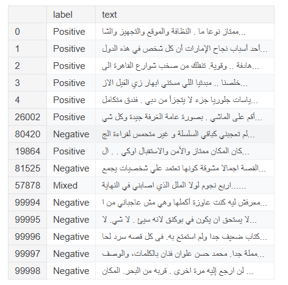
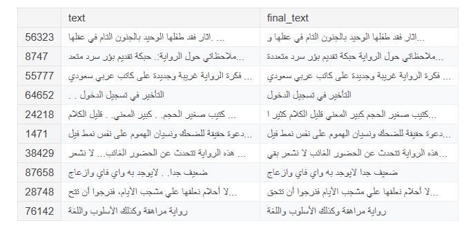
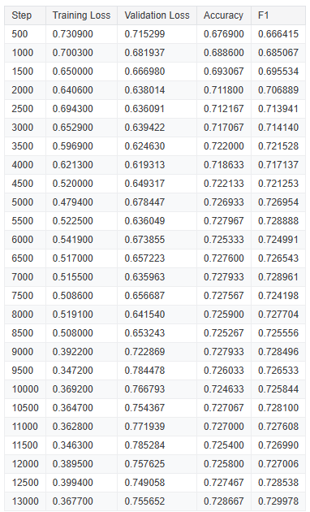

# Arabic Sentiment Analysis with BERT

This project fine-tunes a pre-trained **BERT model** (`asafaya/bert-base-arabic`) on an Arabic sentiment dataset from Kaggle. It classifies reviews as **positive**, **neutral**, or **negative**.

Notebook on kaggle:
[Kaggle Notebook](https://www.kaggle.com/code/youssef019/bert-arabic-reviews-classification)

---

## Overview

This project uses Hugging Face Transformers and PyTorch to fine-tune a BERT-based model for **multi-class sentiment classification** on Arabic text reviews.

Key steps:

* Data loading & exploration
* Text cleaning and normalization
* Label encoding
* Dataset splitting
* Tokenization for BERT
* Model fine-tuning using Hugging Face `Trainer`
* Performance evaluation using **accuracy** and **F1 score**

---

## Dataset

The dataset used is **Arabic 100k Reviews** from Kaggle:
[Dataset Link](https://www.kaggle.com/datasets/abedkhooli/arabic-100k-reviews)

The dataset contains text reviews with labels: `positive`, `negative`, `mixed`.

**Columns:**

* `text`: Arabic review text
* `label`: Sentiment label

**Sample Data:**



---

## Data Preprocessing

### Handling Nulls

The dataset is checked for missing values.

```python
df.isna().sum()
```

### Removing Duplicates

Duplicate entries are removed to ensure dataset quality.

```python
df.duplicated().sum()
```

### Label Encoding

Sentiment labels are encoded as integers:

| Label    | Encoded |
|----------| ------- |
| negative | 0       |
| mixed    | 1       |
| positive | 2       |


### Text Cleaning

Text is normalized by:

* Removing diacritics
* Keeping only Arabic letters and spaces
* Normalizing spaces

**Example Preprocessing Result:**



---

## Data Splitting

The dataset is split into **train** and **validation** sets with a 70/30 ratio.

Converted to Hugging Face `DatasetDict` for compatibility with Transformers:

---

## Model Loading and Tokenization

We use the pre-trained Arabic BERT model:

```python
MODEL_NAME = "asafaya/bert-base-arabic"
tokenizer = AutoTokenizer.from_pretrained(MODEL_NAME)
model = AutoModelForSequenceClassification.from_pretrained(MODEL_NAME, num_labels=3)
```

Tokenization includes padding and truncation for maximum sequence length of 512:

```python
tokenized_dataset = dataset.map(preprocess, batched=True)
tokenized_dataset = tokenized_dataset.remove_columns(["text"])
tokenized_dataset.set_format("torch")
```

---

## Training & Fine-tuning

The model is fine-tuned using Hugging Face `Trainer` with these settings:

* **Batch size:** 8
* **Learning rate:** 2e-5
* **Epochs:** 3
* **Evaluation & checkpointing:** Every 500 steps
* **FP16 training:** Enabled for faster GPU training

---

## Evaluation

Metrics used:

* **Accuracy**
* **Weighted F1 score**

---

## Results



* Training loss consistently decreased over time, showing that the model was effectively learning from the data.
* Validation accuracy and F1-score gradually improved from ~67% to ~72.9%, indicating better sentiment classification performance.
* Performance stabilized after around 3,000 steps, with minor fluctuations in validation loss suggesting mild overfitting in later stages.

---
